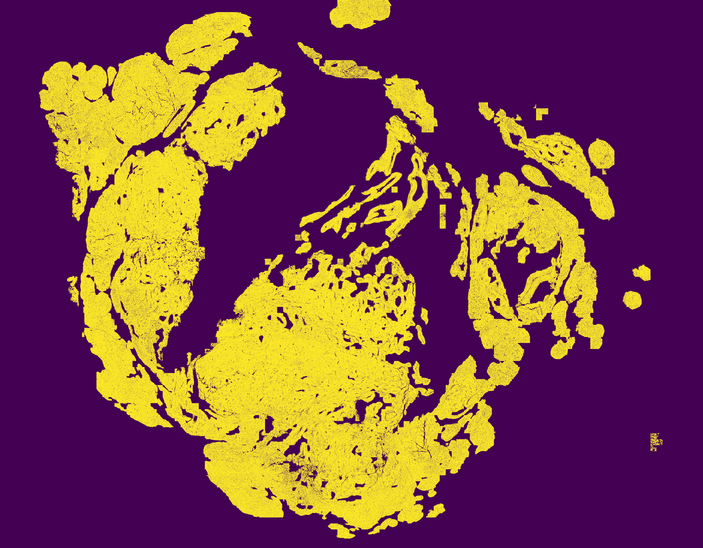

<h1> PAIP2019: Liver Cancer Segmentation </h1>

<a href="https://paip2019.grand-challenge.org/">PAIP2019</a> is the liver cancer segmentation challeng, held as a part of <a href="https://www.miccai2019.org/">MICCAI2019</a>.

The objective of the challenge is to assess advanced computer algorithms for an automated evaluation of liver cancer in whole-slide images (WSIs). 
  It includes two tasks: 1) Task 1: Liver Cancer Segmentation, and 2) Task 2: Viable Tumor Burden Estimation.

This repository contains the deep learing-based methods that we developed for the challenge. 

The methods were ranked 5th and 3rd for Task 1 and 2, respectively.

 

<h1> User Guideline </h1>

<h3>classification</h3>: This file is for training classification model

<h3>preprocessing</h3> : This file is for generating patches for training

<h3>overlap_prediction</h3> : this file is for prediction

<h3>segmentation</h3> : This file is for training segmentation model

<h3>test_result</h3> : This file is test result after removing samll componenets by using connected components

<h3>Result img</h3>

  

 

<h1> Package Requirement </h1>

 

<h1> License </h1>
